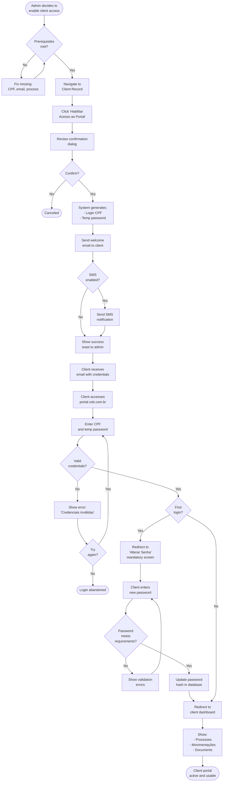

# Client_Activation_Flow.md

## Client Portal Activation – Step-by-Step Guide

This document provides a comprehensive, step-by-step guide for activating client access to the VOB portal.

---
## 1. Overview

**Purpose**: Enable clients to view their own processes, documents, and case updates through a secure web portal.

**Who Can Activate**: Administrator, Advogado Associado (if permissions allow)

**Client Capabilities**: 100% read-only access to own data

---
## 2. Prerequisites

Before activating a client:

✅ Client must be registered in the system (Clientes module)  
✅ Client must have a valid CPF  
✅ Client must have a valid e-mail address  
✅ At least one process must be associated with the client  
✅ Portal must be globally enabled (Settings → Acesso do Cliente)

---
## 3. Activation Flow

### Step 1: Navigate to Client Record
1. Go to **Clientes** module
2. Search for the client by name, CPF, or process number
3. Click on the client name to open the client detail page

---
### Step 2: Check Current Portal Status
- In the client detail page, look for the **"Acesso ao Portal"** section (usually in the right sidebar or at the bottom)
- **Current Status Indicators**:
  - 🔒 **Acesso Desabilitado** (red badge) = Portal access is disabled
  - 🔓 **Acesso Habilitado** (green badge) = Portal access is active
  - Last Access: Shows date/time of last login (if applicable)

---
### Step 3: Click "Habilitar Acesso ao Portal"
1. If status shows "Desabilitado", click the **"Habilitar Acesso ao Portal"** button
2. A confirmation dialog appears:

```
┌─────────────────────────────────────────────┐
│  Habilitar Acesso ao Portal?                │
├─────────────────────────────────────────────┤
│                                             │
│  Cliente: João da Silva                     │
│  CPF: 123.456.789-00                        │
│  E-mail: joao@email.com                     │
│                                             │
│  Login: 123.456.789-00 (CPF)                │
│  Senha Temporária: Será enviada por e-mail │
│                                             │
│  [ ] Enviar instruções de acesso por SMS    │
│                                             │
│  [Cancelar]  [Confirmar]                    │
└─────────────────────────────────────────────┘
```

3. Review the information
4. Optionally check "Enviar instruções de acesso por SMS" if phone number is available
5. Click **"Confirmar"**

---
### Step 4: System Actions (Automated)
Once confirmed, the system automatically:

1. **Generates Credentials**:
   - Login: Client's CPF (without formatting: 12345678900)
   - Temporary Password: Random 8-character string (e.g., `Xy3k9Lm2`)

2. **Creates Portal Access Record**:
   - Inserts entry in `client_portal_access` table
   - Sets `enabled = TRUE`
   - Stores hashed password

3. **Sends Welcome Email**:
   - To: Client's registered email
   - Subject: "Bem-vindo ao Portal VOB – Acesso Liberado"
   - Content:
     ```
     Olá, João da Silva!
     
     Seu acesso ao Portal do Cliente foi liberado.
     
     Acesse: https://portal.vob.com.br
     Login: 123.456.789-00
     Senha Temporária: Xy3k9Lm2
     
     IMPORTANTE: Você será solicitado a alterar sua senha no primeiro acesso.
     
     No portal você poderá:
     ✅ Visualizar seus processos
     ✅ Acompanhar movimentações
     ✅ Baixar documentos liberados
     
     Atenciosamente,
     [Nome do Escritório]
     ```

4. **Sends SMS** (if checkbox was checked):
   - Message: "Seu acesso ao Portal VOB foi liberado. Login: CPF. Senha temporária enviada por e-mail. Acesse: portal.vob.com.br"

5. **Shows Success Toast**:
   - "✅ Acesso ao portal habilitado com sucesso! E-mail de boas-vindas enviado para joao@email.com"

---
### Step 5: Client First Login

#### 5.1 Client Accesses Portal
1. Client opens `https://portal.vob.com.br`
2. Sees login screen with fields:
   - CPF (with input mask: ***.***.***-**)
   - Senha

#### 5.2 Client Enters Credentials
- CPF: `123.456.789-00`
- Senha: `Xy3k9Lm2` (temporary password from email)

#### 5.3 System Forces Password Change
1. After successful authentication, system detects first login
2. Redirects to **"Alterar Senha"** screen (mandatory)
3. Fields:
   - Senha Atual (pre-filled, read-only)
   - Nova Senha (password input with strength meter)
   - Confirmar Nova Senha
4. Password Requirements Display:
   - ✅ Mínimo 8 caracteres
   - ✅ Pelo menos 1 letra maiúscula
   - ✅ Pelo menos 1 número
   - ✅ Pelo menos 1 caractere especial
5. Client enters new password
6. Clicks "Confirmar"
7. System validates, updates password hash, clears temporary password flag
8. Success message: "Senha alterada com sucesso! Você será redirecionado."

#### 5.4 Client Accesses Dashboard
- Client is redirected to their personal dashboard
- Sees:
  - Welcome message: "Olá, João da Silva!"
  - Summary cards: Total de Processos, Movimentações Recentes, Documentos Disponíveis
  - List of own processes with status indicators

---
## 4. Configure Client Permissions (Optional)

After enabling access, the administrator can fine-tune what the client can see:

### Step 1: Click "Configurar Permissões"
- In the client detail page, click **"Configurar Permissões"** button (appears after access is enabled)

### Step 2: Permission Modal Opens
```
┌─────────────────────────────────────────────┐
│  Configurar Permissões – João da Silva      │
├─────────────────────────────────────────────┤
│                                             │
│  Processos Visíveis:                        │
│  ☑ Processo 0001234-56.2024.8.02.0001      │
│  ☑ Processo 0007890-12.2024.8.02.0001      │
│  ☐ Processo 0005555-99.2023.8.02.0001      │
│                                             │
│  Documentos Acessíveis:                     │
│  ☑ Contrato Social                          │
│  ☑ Petição Inicial                          │
│  ☐ Parecer Interno (Confidencial)          │
│                                             │
│  Permissões Especiais:                      │
│  ☑ Baixar Documentos                        │
│  ☐ Enviar Mensagens ao Escritório          │
│                                             │
│  [Cancelar]  [Salvar]                       │
└─────────────────────────────────────────────┘
```

### Step 3: Select Visible Items
- Check/uncheck processes
- Check/uncheck documents
- Toggle special permissions

### Step 4: Save
- Click "Salvar"
- System updates `client_portal_access` table with selected process/document IDs
- Success toast: "Permissões atualizadas com sucesso!"

---
## 5. Revoke Client Access

If needed, the administrator can revoke access:

### Step 1: Navigate to Client Record
- Go to **Clientes** → Select client

### Step 2: Click "Revogar Acesso"
- In the "Acesso ao Portal" section, click **"Revogar Acesso"** button (red button)

### Step 3: Confirmation Dialog
```
┌─────────────────────────────────────────────┐
│  ⚠️  Revogar Acesso ao Portal?              │
├─────────────────────────────────────────────┤
│                                             │
│  O cliente João da Silva não poderá mais   │
│  acessar o portal. Esta ação pode ser       │
│  revertida a qualquer momento.              │
│                                             │
│  Motivo (opcional):                         │
│  [____________________________________]     │
│                                             │
│  [ ] Notificar cliente por e-mail           │
│                                             │
│  [Cancelar]  [Revogar Acesso]               │
└─────────────────────────────────────────────┘
```

### Step 4: Confirm Revocation
1. Optionally enter reason
2. Check "Notificar cliente por e-mail" if desired
3. Click "Revogar Acesso"
4. System:
   - Sets `enabled = FALSE` in database
   - Client login immediately blocked
   - Audit log entry created
   - Optional email sent to client
5. Success toast: "Acesso ao portal revogado."

---
## 6. Bulk Activation (Multiple Clients)

For firms wanting to enable many clients at once:

### Step 1: Go to Settings → Acesso do Cliente
- Navigate to **Configurações** → **Acesso do Cliente**

### Step 2: View "Clientes com Acesso" Table
- Table shows all clients with columns:
  - Cliente
  - CPF
  - E-mail
  - Status do Acesso (Habilitado/Desabilitado)
  - Último Acesso
  - Ações

### Step 3: Bulk Select
- Checkboxes on left of each row
- "Select All" checkbox in table header
- Select multiple clients

### Step 4: Bulk Actions Dropdown
- Appears at top of table when items are selected
- Options:
  - "Habilitar Acesso (X selecionados)"
  - "Revogar Acesso (X selecionados)"
  - "Exportar Credenciais (CSV)"

### Step 5: Confirm Bulk Action
- Click "Habilitar Acesso"
- Confirmation dialog shows count and list of clients
- Click "Confirmar"
- System processes each client sequentially
- Shows progress bar
- Displays summary: "12 acessos habilitados com sucesso. 2 falharam (e-mail inválido)."

---
## 7. Client Login Troubleshooting

### Issue 1: Client Forgot Password
**Solution**:
1. Client clicks "Esqueci minha senha" on login screen
2. Enters CPF
3. System sends password reset email with token link
4. Client clicks link, enters new password
5. System updates password hash

**Alternative** (via admin):
1. Admin goes to client record
2. Clicks "Resetar Senha"
3. New temporary password sent to client

---
### Issue 2: Client Not Receiving Email
**Checklist**:
- ✅ E-mail address is correct in client record
- ✅ Check spam/junk folder
- ✅ SMTP settings are configured correctly (Settings → Integrações → E-mail)
- ✅ Firewall/security not blocking emails

**Solution**:
- Admin can manually copy credentials and send via WhatsApp or SMS

---
### Issue 3: Client Account Locked (Failed Login Attempts)
**Cause**: Client entered wrong password 5+ times

**Solution**:
1. Admin goes to Settings → Backup e Segurança → Logs de Auditoria
2. Finds client login attempts
3. Admin clicks "Desbloquear Conta" button in client record
4. Client can try logging in again

---
## 8. Flowchart: Complete Activation Process



---
## 9. Security Considerations

### 9.1 Password Policy
- Minimum 8 characters
- Must include: uppercase, lowercase, number, special character
- Passwords hashed with bcrypt (cost factor 12)
- No password reuse (last 3 passwords checked)

### 9.2 Session Management
- Session timeout: 30 minutes of inactivity
- Automatic logout on timeout
- Concurrent sessions: Max 2 devices per client

### 9.3 Audit Trail
All client portal actions are logged:
- Login/logout events
- Processes viewed
- Documents downloaded
- Failed login attempts
- IP addresses recorded

### 9.4 Data Isolation
- Strict database-level filtering ensures clients can ONLY access own data
- Row-level security (RLS) policies in place
- API endpoints validate client_id matches authenticated user

---
## 10. Summary Checklist

**Before Activation**:
- [ ] Client has valid CPF
- [ ] Client has valid e-mail
- [ ] At least one process associated
- [ ] Portal globally enabled

**During Activation**:
- [ ] Review client information
- [ ] Click "Habilitar Acesso"
- [ ] Confirm dialog
- [ ] Verify success toast
- [ ] Check email was sent

**After Activation**:
- [ ] Optionally configure permissions
- [ ] Test client login
- [ ] Verify client can view processes
- [ ] Check audit logs

**Client First Access**:
- [ ] Client receives email
- [ ] Client logs in with CPF + temp password
- [ ] Client changes password (mandatory)
- [ ] Client accesses dashboard successfully

---
*Document version 1.0 – 2025‑11‑24*
