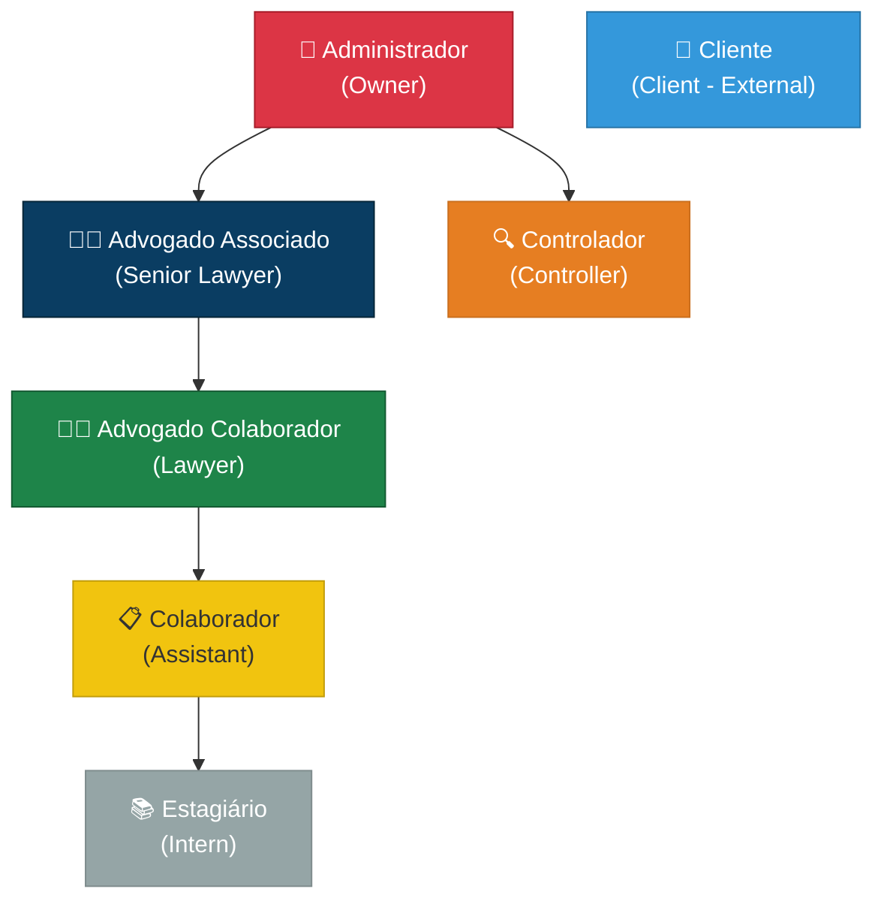
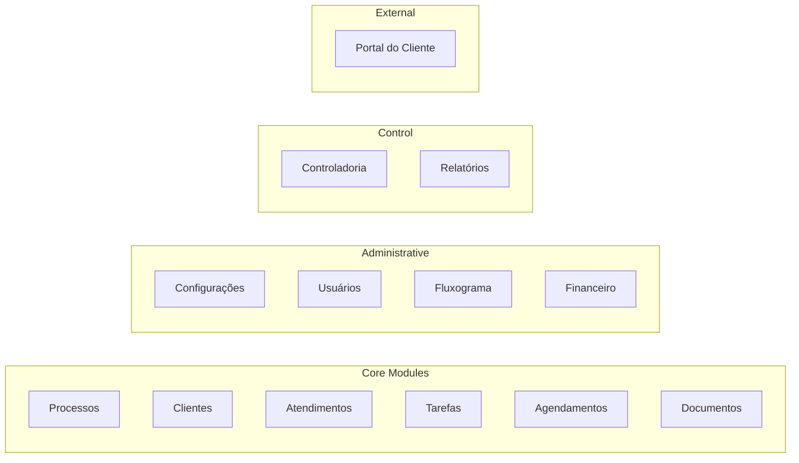
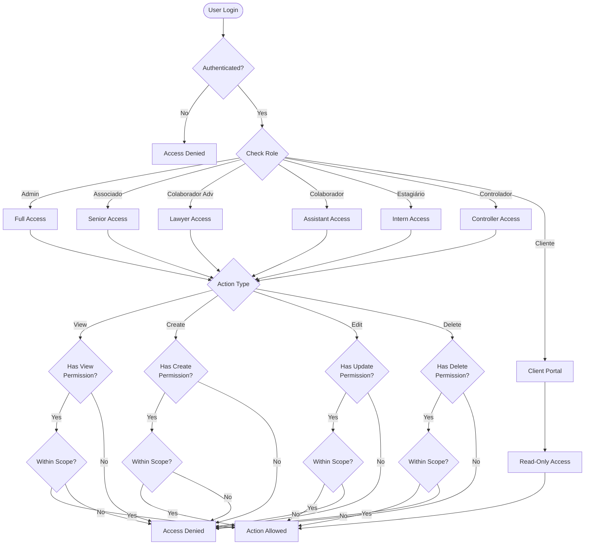

# Permissions_Diagram.md

## User Roles & Permissions Hierarchy – VOB

This document provides visual diagrams and comprehensive permission matrices for the VOB user roles system.

---
## 1. Role Hierarchy

---
## 2. Permission Modules

---
## 3. Detailed Permission Matrix

### 3.1 Administrador (Admin)
| Module | Create | Read | Update | Delete | Special |
|--------|--------|------|--------|--------|---------|
| Processos | ✅ | ✅ | ✅ | ✅ | All processes |
| Clientes | ✅ | ✅ | ✅ | ✅ | All clients |
| Atendimentos | ✅ | ✅ | ✅ | ✅ | All records |
| Tarefas | ✅ | ✅ | ✅ | ✅ | All tasks |
| Agendamentos | ✅ | ✅ | ✅ | ✅ | All events |
| Documentos | ✅ | ✅ | ✅ | ✅ | All docs |
| Configurações | ✅ | ✅ | ✅ | ✅ | Full access |
| Usuários | ✅ | ✅ | ✅ | ✅ | Create/disable |
| Fluxograma | ✅ | ✅ | ✅ | ✅ | Create/edit flows |
| Financeiro | ✅ | ✅ | ✅ | ✅ | Full control |
| Controladoria | ❌ | ✅ | ❌ | ❌ | View only |
| Portal Cliente | ✅ | ✅ | ✅ | ✅ | Enable/disable |

### 3.2 Advogado Associado (Senior Lawyer)
| Module | Create | Read | Update | Delete | Special |
|--------|--------|------|--------|--------|---------|
| Processos | ✅ | ✅ | ✅ | ✅ | All processes |
| Clientes | ✅ | ✅ | ✅ | ✅ | All clients |
| Atendimentos | ✅ | ✅ | ✅ | ✅ | All records |
| Tarefas | ✅ | ✅ | ✅ | ✅ | All tasks |
| Agendamentos | ✅ | ✅ | ✅ | ✅ | All events |
| Documentos | ✅ | ✅ | ✅ | ✅ | All docs |
| Configurações | ❌ | ✅ | ❌ | ❌ | View only |
| Usuários | ❌ | ✅ | ❌ | ❌ | View only |
| Fluxograma | ❌ | ✅ | ❌ | ❌ | View only |
| Financeiro | ✅ | ✅ | ✅ | ❌ | Restricted |
| Controladoria | ❌ | ✅ | ❌ | ❌ | Partial view |
| Portal Cliente | ❌ | ✅ | ❌ | ❌ | View only |

### 3.3 Advogado Colaborador (Lawyer)
| Module | Create | Read | Update | Delete | Special |
|--------|--------|------|--------|--------|---------|
| Processos | ✅ | ✅* | ✅* | ❌ | Own processes only |
| Clientes | ✅ | ✅* | ✅* | ❌ | Own clients only |
| Atendimentos | ✅ | ✅ | ✅ | ❌ | Own records |
| Tarefas | ✅ | ✅ | ✅ | ✅ | Own tasks |
| Agendamentos | ✅ | ✅ | ✅ | ✅ | Own events |
| Documentos | ✅ | ✅* | ✅* | ❌ | Related docs only |
| Configurações | ❌ | ❌ | ❌ | ❌ | No access |
| Usuários | ❌ | ❌ | ❌ | ❌ | No access |
| Fluxograma | ❌ | ✅ | ❌ | ❌ | View only |
| Financeiro | ❌ | ❌ | ❌ | ❌ | No access |
| Controladoria | ❌ | ❌ | ❌ | ❌ | No access |
| Portal Cliente | ❌ | ❌ | ❌ | ❌ | No access |

*Only for items where user is assigned

### 3.4 Colaborador (Assistant)
| Module | Create | Read | Update | Delete | Special |
|--------|--------|------|--------|--------|---------|
| Processos | ⚠️ | ✅* | ✅* | ❌ | If enabled by admin |
| Clientes | ✅ | ✅ | ✅ | ❌ | Basic access |
| Atendimentos | ✅ | ✅ | ✅ | ❌ | All records |
| Tarefas | ✅ | ✅ | ✅ | ✅ | Own tasks |
| Agendamentos | ✅ | ✅ | ✅ | ❌ | Basic access |
| Documentos | ✅ | ✅* | ✅* | ❌ | Related only |
| Configurações | ❌ | ❌ | ❌ | ❌ | No access |
| Usuários | ❌ | ❌ | ❌ | ❌ | No access |
| Fluxograma | ❌ | ✅ | ❌ | ❌ | View only |
| Financeiro | ⚠️ | ⚠️ | ⚠️ | ❌ | If enabled by admin |
| Controladoria | ❌ | ❌ | ❌ | ❌ | No access |
| Portal Cliente | ❌ | ❌ | ❌ | ❌ | No access |

⚠️ = Requires explicit admin permission

### 3.5 Estagiário (Intern)
| Module | Create | Read | Update | Delete | Special |
|--------|--------|------|--------|--------|---------|
| Processos | ❌ | ✅* | ❌ | ❌ | Assigned only, read-only |
| Clientes | ❌ | ✅* | ❌ | ❌ | Related only, read-only |
| Atendimentos | ⚠️ | ✅* | ❌ | ❌ | Basic, if enabled |
| Tarefas | ✅ | ✅* | ✅* | ❌ | Own tasks only |
| Agendamentos | ❌ | ✅* | ❌ | ❌ | View only |
| Documentos | ✅* | ✅* | ❌ | ❌ | Upload to assigned cases |
| Configurações | ❌ | ❌ | ❌ | ❌ | No access |
| Usuários | ❌ | ❌ | ❌ | ❌ | No access |
| Fluxograma | ❌ | ❌ | ❌ | ❌ | No access |
| Financeiro | ❌ | ❌ | ❌ | ❌ | No access |
| Controladoria | ❌ | ❌ | ❌ | ❌ | No access |
| Portal Cliente | ❌ | ❌ | ❌ | ❌ | No access |

*Extremely limited scope

### 3.6 Controlador (Controller)
| Module | Create | Read | Update | Delete | Special |
|--------|--------|------|--------|--------|---------|
| Processos | ❌ | ✅ | ❌ | ❌ | View all, no edit |
| Clientes | ❌ | ✅ | ❌ | ❌ | View all |
| Atendimentos | ❌ | ✅ | ❌ | ❌ | View all |
| Tarefas | ✅ | ✅ | ✅ | ❌ | Control tasks |
| Agendamentos | ❌ | ✅ | ❌ | ❌ | View all |
| Documentos | ❌ | ✅ | ❌ | ❌ | View all |
| Configurações | ❌ | ❌ | ❌ | ❌ | No access |
| Usuários | ❌ | ✅ | ❌ | ❌ | View only |
| Fluxograma | ❌ | ✅ | ✅ | ❌ | Control flow steps |
| Financeiro | ❌ | ❌ | ❌ | ❌ | No access |
| Controladoria | ✅ | ✅ | ✅ | ❌ | Full dashboard access |
| Portal Cliente | ❌ | ❌ | ❌ | ❌ | No access |

### 3.7 Cliente (Client - External)
| Module | Create | Read | Update | Delete | Special |
|--------|--------|------|--------|--------|---------|
| Processos | ❌ | ✅* | ❌ | ❌ | Own cases only |
| Clientes | ❌ | ✅* | ❌ | ❌ | Own data only |
| Atendimentos | ❌ | ✅* | ❌ | ❌ | Own records only |
| Tarefas | ❌ | ❌ | ❌ | ❌ | No access |
| Agendamentos | ❌ | ❌ | ❌ | ❌ | No access |
| Documentos | ❌ | ✅* | ❌ | ❌ | Approved docs only |
| Configurações | ❌ | ❌ | ❌ | ❌ | No access |
| Usuários | ❌ | ❌ | ❌ | ❌ | No access |
| Fluxograma | ❌ | ❌ | ❌ | ❌ | No access |
| Financeiro | ❌ | ❌ | ❌ | ❌ | No access |
| Controladoria | ❌ | ❌ | ❌ | ❌ | No access |
| Portal Cliente | ❌ | ✅ | ❌ | ❌ | Own portal only |

**100% read-only access to own data**

---
## 4. Access Control Flow

---
## 5. Summary Table: Quick Reference

| Role | Level | Config Access | User Mgmt | Flowchart | Finance | Controladoria | Client Portal |
|------|-------|---------------|-----------|-----------|---------|---------------|---------------|
| Administrador | 🔴 Highest | ✅ Full | ✅ Full | ✅ Create/Edit | ✅ Full | 👁️ View | ✅ Manage |
| Advogado Associado | 🟠 High | 👁️ View | 👁️ View | 👁️ View | ⚠️ Partial | 👁️ Partial | 👁️ View |
| Advogado Colaborador | 🟡 Medium | ❌ None | ❌ None | 👁️ View | ❌ None | ❌ None | ❌ None |
| Colaborador | 🟢 Low-Med | ❌ None | ❌ None | 👁️ View | ⚠️ Optional | ❌ None | ❌ None |
| Estagiário | 🔵 Low | ❌ None | ❌ None | ❌ None | ❌ None | ❌ None | ❌ None |
| Controlador | 🟣 Special | ❌ None | 👁️ View | ✅ Control | ❌ None | ✅ Full | ❌ None |
| Cliente | ⚪ External | ❌ None | ❌ None | ❌ None | ❌ None | ❌ None | 👁️ Own Only |

**Legend:**
- ✅ Full Access
- 👁️ View Only
- ⚠️ Conditional/Partial
- ❌ No Access

---
*Document version 1.0 – 2025‑11‑24*
